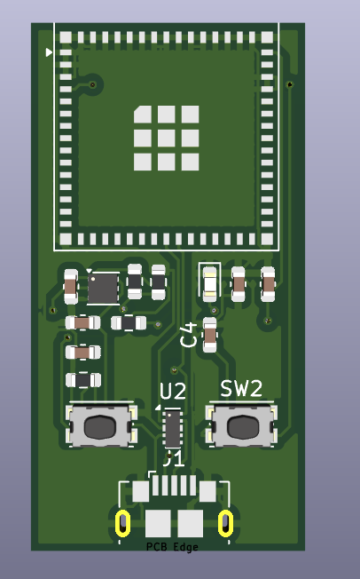

# ESP32-S3 Mini Breakout Board

ESP32-S3-MINI-1 modülü için tasarlanmış, kompakt ve yüksek performanslı bir geliştirme kartı.

## Proje Önizlemesi

## Teknik Özellikler
* **Mikrodenetleyici:** ESP32-S3-MINI-1 (Dahili antenli modül)
* **Güç Girişi:** 5V (Micro-USB / VBUS üzerinden)
* **Voltaj Regülatörü:** TLV75801PDRV (5V -> 3.3V LDO)
* **Koruma:** USB veri hatları için D3V3XA4B10LP ESD koruma diyot dizisi
* **Kontrol:** Fiziksel Reset ve Boot butonları

## Tasarım Detayları
* **Anten Performansı:** RF sinyal kalitesini korumak amacıyla antenin altında tüm katmanlarda bakır girilmez bölge (Keepout Area) tanımlanmıştır.
* **USB Diferansiyel Çifti:** USB veri yolları sinyal bütünlüğü için paralel ve dengeli bir şekilde kurgulanmıştır.
* **PCB Katmanları:** Çift katmanlı (FR4) tasarım.

